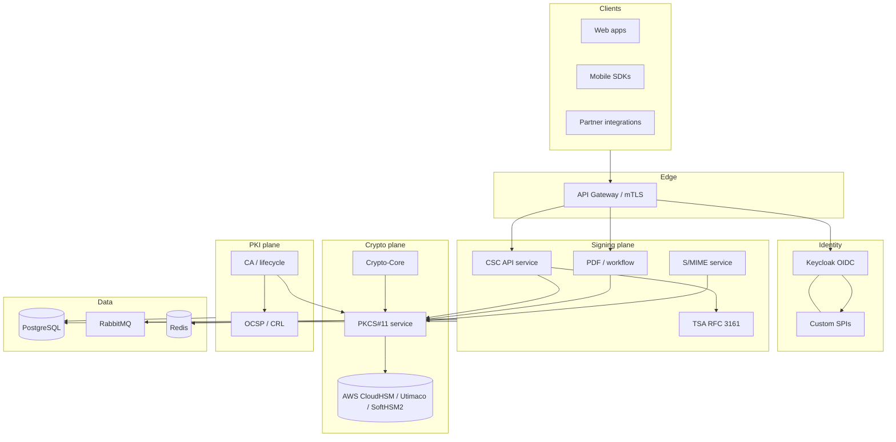

# Signing & Trust Platform Architecture (Reference)

Reference architecture for **PKI**, **CSC remote signing**, **HSM**, and **Keycloak IAM** — aligned with [Talha Bilal's portfolio](https://talha-bilal.github.io/portfolio/).

## Service responsibilities

| Component | Role |
|-----------|------|
| **Keycloak** | SSO/OIDC, tenant realms, custom SPIs for certificate-aware login |
| **CSC API** | Standard remote signing for apps (`credentials`, `signHash`, timestamps) |
| **PKCS#11 layer** | Vendor-neutral HSM access, pooled sessions, RBAC |
| **PKI / CA** | Issuance, renewal, OCSP/CRL, policy per tenant |
| **Crypto-Core** | Shared key generation, CSR, encrypt/decrypt |
| **Java Card** | Edge credentials & secure elements (issuance ceremonies) |

## Typical remote signing path

1. Client obtains OAuth token (Keycloak or CSC client credentials).
2. CSC `credentials/list` + `authorize` → Signature Activation Data (SAD).
3. Client sends hash to `signatures/signHash`.
4. CSC service uses PKCS#11 → HSM for signature generation.
5. Optional RFC 3161 timestamp from TSA service.
6. Audit event persisted per tenant.

## Security controls (production)

- mTLS or gateway-terminated client certificates
- Per-tenant realm isolation and HSM key partitioning
- Immutable audit logs for signing and IAM events
- Rate limits on CSC authorize/sign endpoints
- No private keys outside HSM except Java Card secure elements

## Samples in this repository

- [Keycloak Authenticator SPI](../keycloak-pki-authenticator/)
- [CSC OpenAPI](../csc-remote-signing-openapi/)
